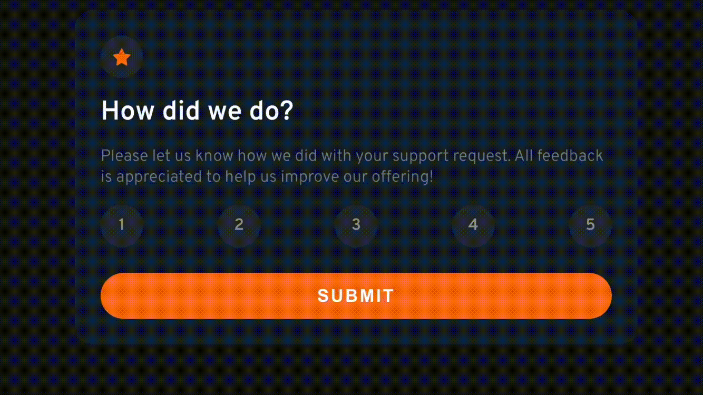

Un componente Card con la funcionalidad de evaluar la opinión del cliente. ✔️
Usa useSate y props para su funcionamiento.

Link del reto de frontend mentor = [Ir al reto](https://www.frontendmentor.io/challenges/interactive-rating-component-koxpeBUmI)

